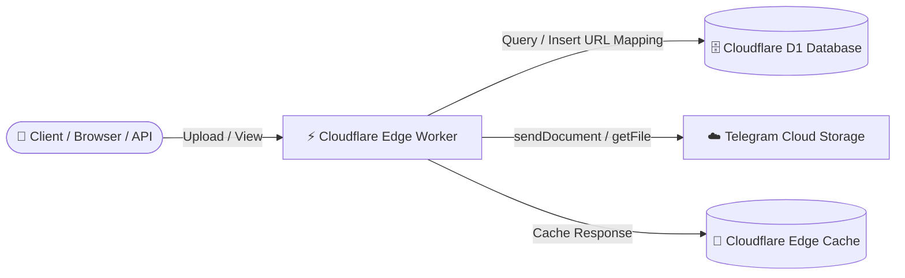

<div align="center">

# 🚀 AR Hosting

**A high-performance, serverless media hosting service built on Cloudflare Pages/Workers, backed by Telegram cloud storage and Cloudflare D1.**

[](LICENSE)
[](https://pages.cloudflare.com/)
[](https://developers.cloudflare.com/d1/)
[](https://core.telegram.org/bots/api)
[-F7DF1E?style=for-the-badge&logo=javascript&logoColor=black)](_worker.js)

<br/>

[**Live Demo**](https://ar-hosting.pages.dev/) • [**API Documentation**](https://ar-hosting.pages.dev/docs) • [**Telegram Bot**](https://t.me/AR_UrlUploaderBot) • [**Deployment Guide**](#-deployment-guide) • [**Credits & Fork Info**](#-original-author--credits)

</div>

---

## 📖 Overview

**AR Hosting** turns Telegram into an unlimited, zero-cost cloud storage backend for your web applications, bots, and personal media hosting. Powered by **Cloudflare Workers / Pages** at the edge and **Cloudflare D1 (Serverless SQLite)** for metadata indexing, AR Hosting delivers lightning-fast uploads, edge-cached media streaming, and an admin dashboard.

This repository is an enhanced and modernized fork of [`0-RTT/telegraph`](https://github.com/0-RTT/telegraph).

---

## 🏗️ Architecture



1. **Upload Phase**: When media is uploaded (via Web UI, REST API, or URL ingestion), the Cloudflare Worker sends the file to a private Telegram channel via the Telegram Bot API and indexes the `(url, fileId, filename)` in Cloudflare D1.
2. **Retrieval Phase**: Requests to `/<timestamp>.<ext>` query D1 for the Telegram `fileId`, stream the file directly from Telegram servers, apply security headers, and store the response in Cloudflare's global edge cache (`caches.default`) for fast subsequent loads.

---

## ✨ Features

- ⚡ **Zero-Cost Serverless Hosting**: Runs on Cloudflare Pages/Workers free tier with Telegram as backend storage.
- 📁 **Comprehensive Media Support**: Host images (`.png`, `.jpg`, `.jpeg`, `.gif`, `.webp`, `.svg`, `.bmp`), videos (`.mp4`, `.mov`, `.avi`, `.webm`, `.mkv`), audio (`.mp3`, `.wav`), documents (`.pdf`, `.txt`, `.json`, `.csv`), and stickers.
- 🌐 **Dual Upload Modes**:
  - Direct multipart file uploads (`POST /upload`).
  - Remote URL ingestion and mirroring (`GET /hosturl?url=...`).
- 🚀 **Global Edge Caching**: Utilizes Cloudflare Cache API for edge response delivery.
- 🎨 **Modern Web Interface**:
  - Glassmorphic, responsive dark/light mode UI.
  - Drag-and-drop & clipboard paste file upload.
  - Real-time upload progress tracking.
  - Client-side upload history cache (stored in `localStorage`).
  - Instant QR code generation & download for uploaded links.
- 🛡️ **Paginated Admin Gallery (`/admin`)**:
  - HTTP Basic Authentication protection.
  - Infinite scroll with lazy loading (`IntersectionObserver`).
  - Batch selection & link copying (Direct URLs, Markdown, BBCode).
  - Batch file deletion (`POST /delete-images`) with automatic edge cache invalidation.
- 🔒 **Security Hardened**:
  - Executable/script files (`.html`, `.js`, `.css`, `.xml`, `.svg`) are served with `Content-Disposition: attachment` to prevent XSS and malicious script execution.
  - Safe media formats are served `inline` for smooth in-browser rendering.
  - Optional global basic authentication (`ENABLE_AUTH`).
- 📚 **Built-in API Documentation**: Interactive, mobile-friendly documentation page at `/docs`.
- 📱 **Progressive Web App (PWA)**: Includes `manifest.json` and service worker (`sw.js`) for installable mobile and desktop experience.
- 🖼️ **Wallpaper Integration**: Built-in `/wallpapers` endpoint to discover curated HD wallpapers.

---

## 🗂️ Project Structure

```text
AR_HOSTING/
├── _worker.js             # Main Cloudflare Pages / Worker application (All-in-one)
├── manifest.json          # Web App Manifest for PWA installation
├── sw.js                  # Service Worker for PWA asset caching
├── wrangler.toml.example  # Configuration template for Wrangler CLI deployment
├── LICENSE                # MIT License
└── README.md              # Project documentation
```

---

## 🚀 Deployment Guide

### Prerequisites

1. A [Cloudflare Account](https://dash.cloudflare.com/) (free tier is sufficient).
2. A **Telegram Bot Token**:
   - Open Telegram and message [@BotFather](https://t.me/BotFather).
   - Send `/newbot` and follow the instructions to create your bot. Copy the generated `TG_BOT_TOKEN`.
3. A **Telegram Channel/Group**:
   - Create a new Telegram channel or group.
   - Add your bot as an **Administrator** with permission to post messages.
   - Obtain the Channel ID (e.g., `-1001234567890`) using [@userinfobot](https://t.me/userinfobot) or forwarding a message to [@JsonDumpBot](https://t.me/JsonDumpBot).

---

### Step 1: Create Cloudflare D1 Database

1. In the Cloudflare Dashboard, navigate to **Storage & Databases** > **D1 SQL Database**.
2. Click **Create Database**, name it `ar_hosting_db`, and click **Create**.
3. Open the **Console** tab of your new D1 database and execute the following SQL to create the table:

```sql
CREATE TABLE IF NOT EXISTS media (
  url TEXT PRIMARY KEY,
  fileId TEXT NOT NULL,
  filename TEXT
);
```

*(Optional: If using Wrangler CLI, run:)*
```bash
npx wrangler d1 create ar_hosting_db
npx wrangler d1 execute ar_hosting_db --command "CREATE TABLE IF NOT EXISTS media (url TEXT PRIMARY KEY, fileId TEXT NOT NULL, filename TEXT);"
```

---

### Step 2: Deploy to Cloudflare Pages (Recommended)

1. **Fork or Clone** this repository to your GitHub account:
   ```bash
   git clone https://github.com/<your-username>/AR_HOSTING.git
   cd AR_HOSTING
   ```
2. In Cloudflare Dashboard, go to **Workers & Pages** > **Create application** > **Pages** > **Connect to Git**.
3. Select your forked `AR_HOSTING` repository.
4. Configure the build settings:
   - **Framework preset**: `None`
   - **Build command**: *(leave blank)*
   - **Build output directory**: `/` (root)
5. Click **Save and Deploy**.

---

### Step 3: Bind D1 Database & Set Environment Variables

1. Go to your Cloudflare Pages project > **Settings** > **Functions**.
2. Scroll to **D1 database bindings**:
   - Click **Add binding**.
   - **Variable name**: `DATABASE`
   - **D1 database**: Select `ar_hosting_db`.
3. Go to **Settings** > **Environment variables** > **Production** (and Preview if desired) and add:

| Variable | Required | Default | Description | Example Value |
| :--- | :---: | :---: | :--- | :--- |
| `DOMAIN` | **Yes** | — | Deployed domain (without `https://`) | `ar-hosting.pages.dev` |
| `TG_BOT_TOKEN` | **Yes** | — | Telegram Bot API Token | `123456:ABC-DEF1234ghIkl-zyx57W2v1u123ew11` |
| `TG_CHAT_ID` | **Yes** | — | Telegram Channel/Group ID | `-1001234567890` |
| `DATABASE` | **Yes** | — | Cloudflare D1 Database Binding name | `DATABASE` |
| `USERNAME` | **Yes** | — | Admin username for `/admin` & deletion | `admin` |
| `PASSWORD` | **Yes** | — | Admin password | `YourSuperSecretPassword` |
| `ENABLE_AUTH` | No | `false` | Enable HTTP Basic Auth on root & upload (`true`/`false`) | `false` |
| `MAX_SIZE_MB` | No | `20` | Max file upload limit in MB | `20` |

4. Go to **Deployments** and trigger a **Retry deployment** or create a new commit so the bindings take effect.

---

### Alternative: Deploy via Wrangler CLI

1. Copy the example configuration:
   ```bash
   cp wrangler.toml.example wrangler.toml
   ```
2. Fill in your `database_id`, `TG_BOT_TOKEN`, `TG_CHAT_ID`, `DOMAIN`, etc., in `wrangler.toml`.
3. Deploy directly:
   ```bash
   npx wrangler pages deploy . --project-name ar-hosting
   ```

---

## 📡 API Reference

### 1. Upload File (Form-Data)

Upload any supported image, video, audio, or document.

- **Endpoint**: `POST /upload`
- **Content-Type**: `multipart/form-data`
- **Body**: `file` (Binary File)

#### cURL Example
```bash
curl -X POST https://ar-hosting.pages.dev/upload \
  -F "file=@/path/to/image.png"
```

#### JavaScript Example
```javascript
const formData = new FormData();
formData.append('file', fileInput.files[0]);

const response = await fetch('https://ar-hosting.pages.dev/upload', {
  method: 'POST',
  body: formData
});

const data = await response.json();
console.log('Media URL:', data.url);
```

#### Response (`200 OK`)
```json
{
  "data": "https://ar-hosting.pages.dev/1753020712833.png",
  "url": "https://ar-hosting.pages.dev/1753020712833.png",
  "filename": "image.png",
  "size": 83638,
  "uploaded_on": "2026-08-19T14:11:52.833Z",
  "media_type": "image/png",
  "creator": "https://t.me/Ashlynn_Repository"
}
```

---

### 2. Upload from Remote URL

Download a remote file and mirror it on AR Hosting.

- **Endpoint**: `GET /hosturl?url=<MEDIA_URL>`

#### cURL Example
```bash
curl "https://ar-hosting.pages.dev/hosturl?url=https://images.unsplash.com/photo-1579783902614-a3fb3927b675"
```

#### Response (`200 OK`)
```json
{
  "data": "https://ar-hosting.pages.dev/1753020799102.jpeg",
  "url": "https://ar-hosting.pages.dev/1753020799102.jpeg",
  "filename": "photo-1579783902614-a3fb3927b675",
  "size": 245910,
  "uploaded_on": "2026-08-19T14:13:19.102Z",
  "media_type": "image/jpeg",
  "creator": "https://t.me/Ashlynn_Repository"
}
```

---

### 3. Retrieve Hosted Media

- **Endpoint**: `GET /<timestamp>.<ext>`
- **Behavior**: Streams media directly with appropriate `Content-Type` and HTTP Edge Cache headers (`Cache-Control: public`).

---

### 4. Admin Paginated Media API

- **Endpoint**: `GET /admin/api/media?page=1&limit=100`
- **Headers**: `Authorization: Basic <base64(username:password)>`

#### Response (`200 OK`)
```json
{
  "media": [
    {
      "fileId": "BAACAgIAAxkBAAI...",
      "url": "https://ar-hosting.pages.dev/1753020712833.png"
    }
  ],
  "total": 1250,
  "page": 1,
  "limit": 100,
  "has_more": true
}
```

---

### 5. Batch Delete Files (Admin Only)

- **Endpoint**: `POST /delete-images`
- **Headers**: 
  - `Authorization: Basic <base64(username:password)>`
  - `Content-Type: application/json`
- **Body**: JSON Array of URLs to delete

```bash
curl -X POST https://ar-hosting.pages.dev/delete-images \
  -u "admin:YourSuperSecretPassword" \
  -H "Content-Type: application/json" \
  -d '["https://ar-hosting.pages.dev/1753020712833.png"]'
```

---

### 6. Wallpapers Feed

- **Endpoint**: `GET /wallpapers`
- **Returns**: Curated HD wallpaper links in JSON format with edge caching.

---

## 🤖 Telegram Bot Integration

You can pair AR Hosting with a dedicated Telegram bot (such as [@AR_UrlUploaderBot](https://t.me/AR_UrlUploaderBot)):

1. Open the bot on Telegram.
2. Send any photo, video, document, audio file, or a media URL.
3. The bot uploads the file to AR Hosting and returns the direct public CDN URL immediately.

---

## 👏 Original Author & Credits

- **Original Project**: [`0-RTT/telegraph`](https://github.com/0-RTT/telegraph) by [0-RTT](https://github.com/0-RTT).
- **Fork Maintainer & Modifications**: [Aarabh](https://github.com/itz-ashlynn) ([Ashlynn Repository](https://t.me/Ashlynn_Repository) / [@itz_ashlynn](https://t.me/itz_ashlynn)).

### 🌟 Key Enhancements in this Fork
1. **Cloudflare D1 SQL Integration**: Replaced legacy KV/binding lookups with Cloudflare D1 for persistent, relational metadata tracking and pagination.
2. **Infinite Scroll Admin Gallery**: Re-engineered `/admin` with paginated API (`/admin/api/media`), IntersectionObserver lazy loading, multi-format export (Markdown/BBCode/URLs), and batch deletion with Cloudflare edge cache purging.
3. **Advanced Web UI**: Modern glassmorphic interface with client-side SHA-256 hash caching, local history drawer, QR code generation and download, and responsive dark/light themes.
4. **Enhanced Security**: Automatic content disposition adjustment for potentially executable files (HTML, JS, SVG, XML) to mitigate web security vulnerabilities.
5. **Interactive `/docs`**: Built-in, responsive API documentation page.
6. **Broader Media Support**: Direct handling for audio (`mp3`, `wav`), documents, stickers, and automatic GIF conversion for Telegram compatibility.

---

## 📄 License

This project is licensed under the [MIT License](LICENSE).

---

## ⚠️ Disclaimer

AR Hosting is an independent, open-source project intended for personal, educational, and authorized media hosting purposes. It is not officially affiliated with or endorsed by Telegram or Cloudflare. Users are responsible for ensuring that uploaded media complies with relevant laws, terms of service, and copyright regulations.